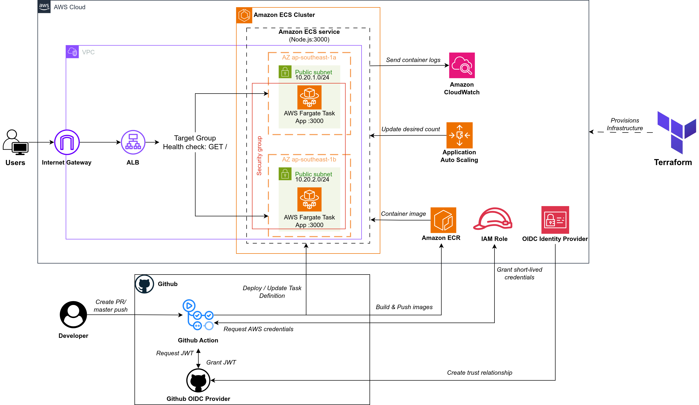

# Golden Owl DevOps Internship Challenge

A containerized Node.js application with a fully automated CI/CD pipeline deployed to AWS using GitHub Actions, Amazon ECR, and Amazon ECS Fargate (provisioned with Terraform).

**Live endpoint:** [http://goldenowl-devops-alb-1233269263.ap-southeast-1.elb.amazonaws.com](http://goldenowl-devops-alb-1233269263.ap-southeast-1.elb.amazonaws.com/)

```sh
curl http://goldenowl-devops-alb-1233269263.ap-southeast-1.elb.amazonaws.com

e.g:
nhatnguyen@openstack-aio:~/Desktop/goldenowl-devops-internship-challenge$ curl http://goldenowl-devops-alb-1233269263.ap-southeast-1.elb.amazonaws.com
{"message":"Welcome warriors to Golden Owl!"}
```

---

## Architecture

**Link visual flow diagrams:** [drive.google.com/file/d/1eBmD9w_pqyAu1WcoG9Wx5QUBJ3naG1ZZ/view?usp=drive_link](https://drive.google.com/file/d/1eBmD9w_pqyAu1WcoG9Wx5QUBJ3naG1ZZ/view?usp=drive_link)



### Infrastructure components

| Component          | Service                      | Detail                                     |
| ------------------ | ---------------------------- | ------------------------------------------ |
| Container registry | Amazon ECR                   | Image immutability enabled, scan on push   |
| Compute            | Amazon ECS Fargate           | Serverless containers, no EC2 to manage    |
| Load balancer      | Application Load Balancer    | HTTP listener on target group             |
| Auto scaling       | AWS Application Auto Scaling | Target tracking on CPU, 1–2 tasks         |
| Networking         | VPC + public subnets         | 2 AZs (ap-southeast-1a, ap-southeast-1b)   |
| Logging            | Amazon CloudWatch Logs       | 7-day retention                            |
| IaC                | Terraform                    | Modules: terraform/ecr/ and terraform/ecs/ |

---

## CI Pipeline — GitHub Actions

**Trigger:** push to **feature/xxx** branches, or pull request targeting **master** (Documentation and Terraform files are excluded)

There are 2 tasks:

1. **lint-and-test**: Checkout → Setup Node.js 24 → npm ci → ESLint check → Prettier format check → npm test
2. **docker-build**: Build image → Run container on port 3000 → curl to test → assert response → Remove container

---

## CD Pipeline — GitHub Actions

**Trigger:** push to master (excludes documentation files), or manual workflow_dispatch

**publish-and-deploy:**

1. Checkout
2. Configure AWS credentials (OIDC)
3. ECR login
4. Prepare image tag
5. Build Docker image (skipped if same SHA already in ECR)
6. Push to ECR
7. Download current ECS task definition
8. Render new task definition with updated image URI
9. Deploy to ECS and wait for service stability
10. Test live ALB endpoint

---

### Authentication — OIDC

- AWS credentials are obtained using GitHub's OIDC provider.
- The IAM role goldenowl-devops-github-deployer has a trust policy scoped to this specific repository and branch.
- No static AWS keys are stored.

---

## Repository Structure

```text
.
├── .github/
│   └── workflows/
│       ├── ci.yml          # Lint, test, Docker build verification
│       └── cd.yml          # Build → ECR push → ECS deploy
├── src/
│   ├── Dockerfile
│   ├── index.js
│   ├── routes/
│   └── tests/
└── terraform/
    ├── ecr/                # ECR repository + OIDC provider
    └── ecs/                # ECS cluster, service, ALB, networking, IAM, auto scaling
```

---

## Infrastructure — Terraform

Infrastructure is split into two independent modules.

### ECR module

Provisions:

- ECR repository with image immutability and scan-on-push
- GitHub Actions OIDC provider

### ECS module

Provisions:

- VPC with 2 public subnets across 2 availability zones
- Security groups (ALB → ECS tasks)
- Application Load Balancer + target group + listener
- ECS cluster + Fargate task definition + service
- CloudWatch log group
- IAM roles (task execution, task, GitHub deployer)
- Application Auto Scaling: target tracking on CPU utilization (70%), min 1 / max 2 tasks

### Deploy infrastructure

#### Prerequisites

* AWS CLI installed and configured with appropriate permissions.
* Terraform installed.
* Docker installed and running locally.

#### Step 1: Provision ECR and OIDC provider

First, provision the ECR repository and the GitHub OIDC provider configuration. This role is needed so GitHub Actions can safely push images to AWS without static access keys.

```sh
cd terraform/ecr
cp terraform.tfvars.example terraform.tfvars
```

Edit terraform.tfvars with your settings:

* aws_region: ap-southeast-1
* github_owner: Your GitHub username
* github_repository_name: goldenowl-devops-internship-challenge
* github_branch: master

Initialize and apply the configuration:

```sh
terraform init
terraform apply
```

Take note of the Terraform outputs.

---

#### Step 2: Build and push the initial bootstrap image

Before provisioning the ECS cluster, push an initial bootstrap image to your ECR repository. Otherwise, the ECS task creation will fail because the image specified in the task definition doesn't exist yet.

Run these commands:

```sh
# Authenticate Docker to ECR
aws ecr get-login-password --region ap-southeast-1 | docker login --username AWS --password-stdin <AWS_ACCOUNT_ID>.dkr.ecr.ap-southeast-1.amazonaws.com

# Build the Docker image locally
docker build -t <ECR_REPOSITORY_URL>:latest ./src

# Push the image to ECR
docker push <ECR_REPOSITORY_URL>:latest
```

---

#### Step 3: Provision ECS and Networking

Now, navigate to the ECS directory to provision the VPC, Load Balancer, ECS cluster, service, task definitions, and Auto Scaling.

```sh
cd terraform/ecs
cp terraform.tfvars.example terraform.tfvars
```

Edit terraform.tfvars:

* container_image: Fill this with the ECR image URI you pushed in Step 2 (e.g., <ECR_REPOSITORY_URL>:latest).
* Verify GitHub repository owner and name match your settings.

Apply the Terraform configuration:

```sh
terraform init
terraform apply
```

Once completed, it will output the **Application Load Balancer DNS name**.

---

#### Step 4: Configure GitHub Actions variables

To enable the CI/CD pipeline to deploy new changes automatically, add the following variables in your GitHub Repository settings (Settings → Secrets and variables → Actions → Variables):

| Variable Name      | Value Example                                                   |
| ------------------ | --------------------------------------------------------------- |
| AWS_REGION         | ap-southeast-1                                                  |
| AWS_ACCOUNT_ID     | 123456789012                                                    |
| AWS_ROLE_ARN       | arn:aws:iam::123456789012:role/goldenowl-devops-github-deployer |
| ECR_REPOSITORY     | goldenowl-devops-challenge                                      |
| ECS_CLUSTER        | goldenowl-devops-challenge-cluster                              |
| ECS_SERVICE        | goldenowl-devops-challenge-service                              |
| ECS_CONTAINER_NAME | goldenowl-app                                                   |
| APPLICATION_URL    | http://<ALB_DNS_NAME>                                           |

---

## Running Locally

```sh
cd src
npm install
npm test          # run tests
npm start         # start HTTP server on port 3000

curl localhost:3000
# {"message":"Welcome warriors to Golden Owl!"}
```
